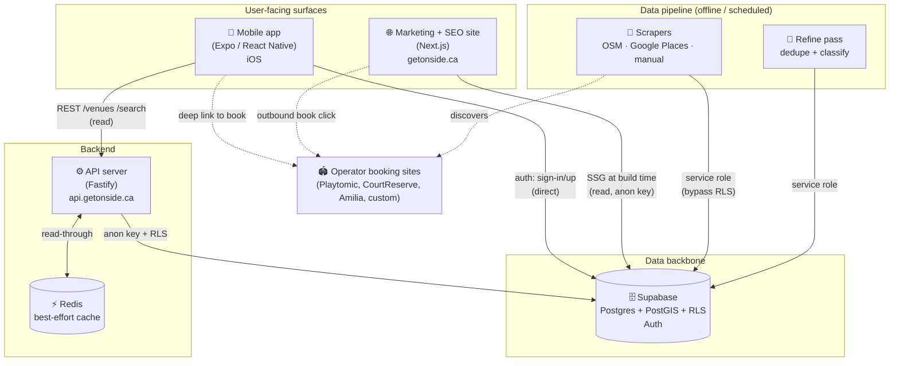
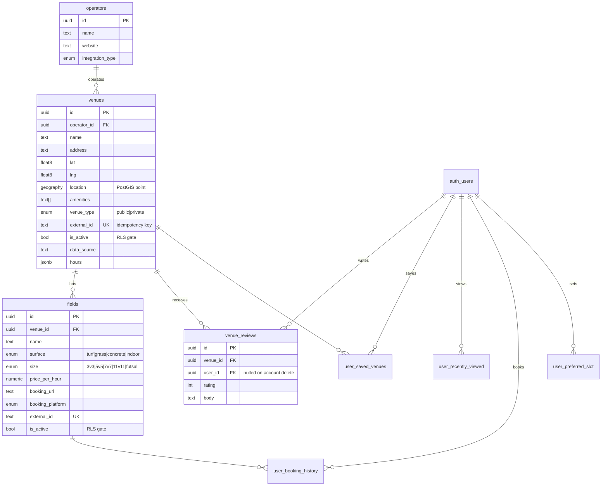
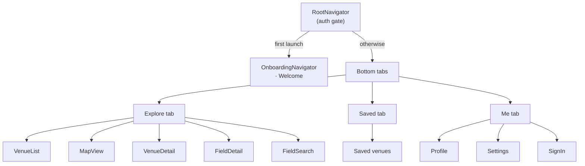
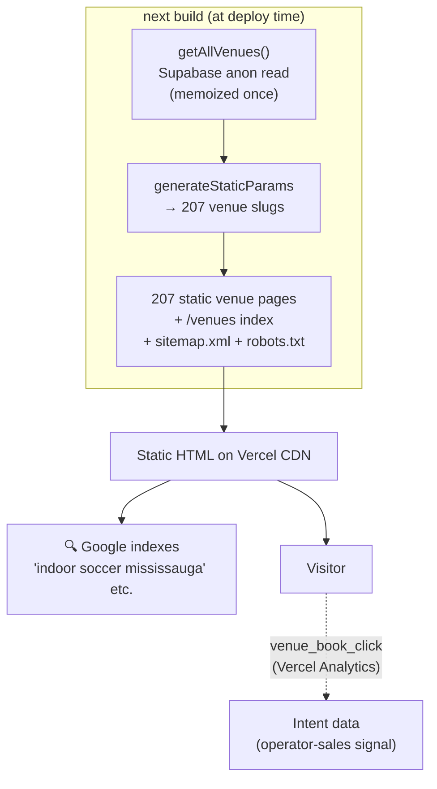
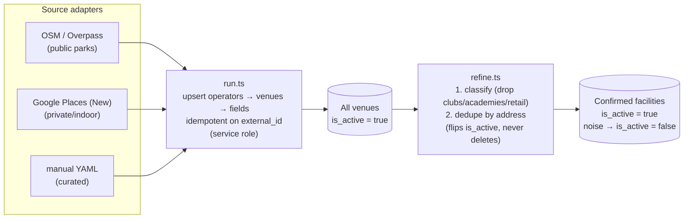
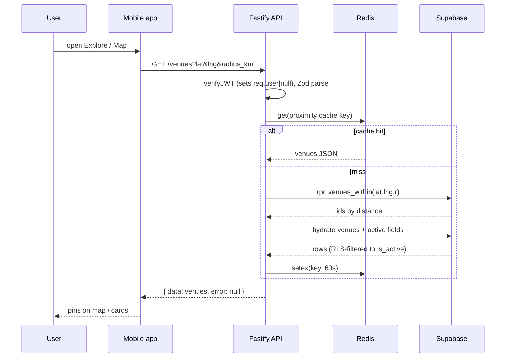
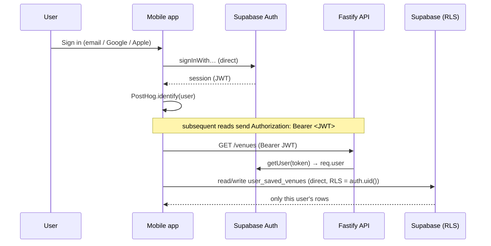
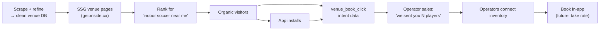
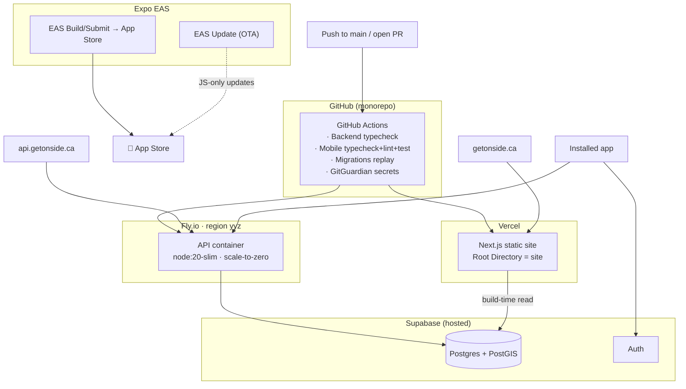

# Onside — System Architecture

> A field-discovery + booking-aggregator for soccer in the Greater Toronto Area.
> Players find a pitch; Onside links them to the operator's own booking page.
> Onside never holds inventory or takes payment (today) — it's a discovery layer
> on top of a clean, deduped database of every venue in the region.

This document explains the **whole system**: what each piece is, how they fit
together, how data flows through them, and where everything runs.

---

## 1. The big picture

Onside is a **monorepo with four surfaces** sitting on **one shared database**.

**Key idea:** the database is the hub. Every surface reads from the same
Supabase tables; the only writers are the user (via Auth + RLS-scoped tables)
and the scraping pipeline (via the service-role key). The API is a thin,
cacheable read layer with auth; the website generates static pages from the
same data at build time.

### Repository layout

| Path | Surface | Stack |
|---|---|---|
| `src/` | Backend API | Fastify 5, TypeScript, tsx |
| `fieldstack-app/` | Mobile app | Expo SDK 54, React Native 0.81, React 19 |
| `site/` | Marketing + SEO site | Next.js 16 (App Router), React 19 |
| `scripts/scrape/` | Data pipeline | TypeScript, run via bun |
| `supabase/migrations/` | Database schema | SQL (21 migrations) |
| `types/database.ts` | Shared DB types | Generated from Supabase |

---

## 2. The data backbone — Supabase

Everything orbits a single Postgres database (hosted by Supabase) with the
**PostGIS** extension for geospatial queries, **Row-Level Security (RLS)** for
authorization, and **Supabase Auth** for identity.

### Entity model

Plus user-data tables (`user_saved_venues`, `user_recently_viewed`,
`user_booking_history`, `user_preferred_slot`), a `venue_review_summary` view
(aggregate rating/count), and a `waitlist` table.

### Authorization model (RLS)

RLS is the **single source of truth for who-can-read-what**, so the API can use
the low-privilege anon key and still be safe:

| Table | Read policy | Write |
|---|---|---|
| `operators` | `using (true)` — fully public | service role only |
| `venues` | `using (is_active)` — only active rows | service role only |
| `fields` | `using (is_active)` | service role only |
| `venue_reviews` | public read | owner (`auth.uid() = user_id`) |
| `user_*` | owner only | owner only |

This is why **`is_active` is the master switch**: the refine pass flips it to
hide a venue everywhere (app, map, search, website) at once, with no code
change and full reversibility.

### Server-side logic (RPCs)

Two Postgres functions do the heavy lifting that's awkward in PostgREST:

- **`venues_within(lat, lng, radius_meters)`** — PostGIS proximity search,
  returns venue ids ordered by distance. Powers the map and "near me" list.
- **`search_fields(...)`** — multi-filter field search (surface, size, price,
  proximity, pagination) joining venues + fields with the `is_active` gates.

### Schema evolution

21 sequential SQL migrations (`supabase/migrations/001…021`) define the schema.
A dedicated **Migrations CI workflow** spins up a fresh `supabase start` and
applies them all to guarantee they replay cleanly from zero (this caught a
`CREATE OR REPLACE FUNCTION` return-type change that needed an explicit `DROP`).

---

## 3. Backend API — Fastify on Fly.io

A small, stateless REST server. Its whole job: serve cached, validated,
RLS-safe reads of venue/field data to the app.

**Endpoints**

| Method · Path | Purpose |
|---|---|
| `GET /venues` | List active venues (+nested active fields). Optional proximity sort (`lat`/`lng`/`radius_km`) via `venues_within`, or exact id set (`?ids=`) for the Saved tab. |
| `GET /venues/:id` | One venue with fields. |
| `GET /venues/:id/fields` | Fields for a venue, filterable by surface/size. |
| `GET /fields` | Field lookups. |
| `GET /search/fields` | Multi-filter search via `search_fields` RPC. |
| `GET /health` | Liveness — 503 only if Supabase is down; Redis degraded ≠ fatal. |

**Design choices worth knowing**

- **Anon key, not service role.** The API authenticates to Supabase with the
  public anon key and leans entirely on RLS for read safety. User identity
  comes from the **`verifyJWT` preHandler**, which validates the Supabase
  bearer token and attaches `req.user` — but *permissively*: guests browse
  fine, and user-scoped endpoints opt in by checking `req.user`.
- **Redis is best-effort.** `cached()` is read-through; if Redis is down or a
  cached entry is malformed, it silently falls through to Supabase. A bad
  `REDIS_URL` can't crash the server (hardened `createRedis`). The API is
  fully functional with no cache.
- **Uniform envelope.** Every response is `{ data, error }`; the central error
  handler maps `ApiError` → its status, `ZodError` → 400, everything else → 500.
- **Stateless** → scales horizontally and **scales to zero** on Fly.io when
  idle (cold-start on first request).

Runs on **Fly.io** (`region: yyz`, Toronto), Dockerized (`node:20-slim`,
`tsx src/index.ts`), fronted by `api.getonside.ca`, `TRUST_PROXY=true` behind
Fly's proxy so per-IP rate limiting sees the real client IP.

---

## 4. Mobile app — Expo / React Native

The primary product. iOS-first (iPhone). React Navigation v7 with a
three-tab root, each tab a native stack.

**State & data layers**

- **Server data** comes through `src/api/client.ts` — a typed `fetch` wrapper
  (`EXPO_PUBLIC_API_URL` → `api.getonside.ca`) that unwraps the `{ data, error }`
  envelope, with a 10s timeout. Hooks (`useVenues`, `useVenue`, `useField`,
  `useFieldSearch`, `useVenueReviews`) wrap these calls.
- **Auth** talks to **Supabase directly** (`src/lib/supabase.ts`) — the API has
  no auth routes. Email/password + **Google & Apple social sign-in**
  (`socialAuth.ts`). The session JWT is what the API's `verifyJWT` validates.
- **Local/offline state** lives in **AsyncStorage-backed React context
  providers**: `auth`, `savedVenues`, `recentlyViewed`, `bookingHistory`,
  `preferredSlot`, `blockedUsers`, `onboarding`, plus a `Toast` provider.
  These also mirror to user-data tables when signed in.
- **Maps** via `react-native-maps`; **theming** via `src/theme` tokens (the
  "Night Kickoff" paper/ink/tangerine identity); **analytics** via PostHog
  (`analyticsProviders.ts` / `analytics.ts`) with `identify`/`reset` on auth;
  **errors** via Sentry.
- **Booking** is a deep link out (`openBooking.ts` / `bookingUrl.ts`) to the
  operator's own page — Onside never transacts.

**Account deletion** anonymizes reviews (sets `user_id` null, migration 021)
rather than hard-deleting them, then clears local data — so the directory keeps
the review content without retaining personal data.

**Shipping & updates**

- Built/submitted via **EAS Build/Submit**.
- **OTA updates** via `expo-updates` with a **fingerprint** `runtimeVersion`:
  JS-only changes ship instantly with `eas update` (no App Store review);
  native changes require a new binary.

---

## 5. Marketing + SEO site — Next.js on Vercel

`getonside.ca`. Two jobs: convert visitors to app installs, and — the growth
engine — **rank in search for every venue**.

- **Static generation (SSG):** at build time, `site/lib/venues.ts` reads the
  same Supabase tables (anon key, RLS) and emits one page per active venue
  (`/venues/[slug]`, slug like `mattamy-indoor-soccer-field-mississauga`), a
  `/venues` index grouped by city, plus `sitemap.xml` and `robots.txt`. **No
  runtime DB calls** — pure CDN HTML.
- **SEO payload per page:** `SportsActivityLocation` + `BreadcrumbList`
  JSON-LD, canonical URL, OpenGraph, and human content (fields, amenities,
  map link, related venues).
- **Intent capture:** the "Book on operator's site" CTA is a client component
  that fires a `venue_book_click` analytics event before redirecting — the raw
  material for the operator-sales pitch ("we sent you N players").
- **Graceful degradation:** if the Supabase env vars aren't set in a given
  build, the data layer returns `[]` and the build still succeeds (just no
  venue pages) — so previews never break.

> Designed to later host an Expo-for-web build of the app itself under the same
> domain.

---

## 6. Data pipeline — how venues get in and get clean

The pipeline runs **offline / on a schedule**, never on a user request. It's a
source-adapter pattern feeding an idempotent upsert, followed by a reversible
cleanup pass.

- **Idempotency:** every venue/field carries an `external_id` (e.g.
  `google:<placeId>`); `run.ts` upserts on conflict, so re-runs **update**
  rather than duplicate.
- **Discovery vs. precision:** scrapers cast a wide net (e.g. Google returned
  ~300 hits). `refine.ts` then collapses same-address duplicates and
  deactivates clubs/academies/retail/wrong-sport — **reversibly**, via
  `is_active`, with an `ALLOWLIST` so manual keeps survive the
  **scrape → refine cycle** (re-scraping reactivates everything, so refine runs
  after each scrape). This cut ~300 raw Google hits to ~125 confirmed
  bookable facilities.
- **Privilege:** the pipeline uses the **service-role key** (bypasses RLS to
  write) — kept strictly server-side, never in any client.
- **Scheduling:** a weekly GitHub Actions cron (`scrape.yml`), secret-gated on
  the service-role key, plus `workflow_dispatch` for manual runs.
- **Booking integrations:** `operators.integration_type` /
  `fields.booking_platform` track per-operator platforms (Playtomic,
  CourtReserve, Amilia, custom) for the future move from "link out" to "book
  in-app" (requires operator credentials — see `docs/scraping.md`).

---

## 7. Key flows end-to-end

### Browsing the map (the most common path)

### Sign-in & authorized data

### The growth loop (why the SEO pages matter)

---

## 8. Infrastructure & deployment

| Concern | How |
|---|---|
| **CI** | GitHub Actions: backend typecheck, mobile typecheck+lint+test, migrations fresh-replay, GitGuardian secret scan. Vercel checks on the site. |
| **API deploy** | Fly.io, Dockerized, scale-to-zero, Toronto region, `api.getonside.ca`. |
| **Site deploy** | Vercel (Root Directory = `site`), static, `getonside.ca`. |
| **App deploy** | EAS Build → App Store; EAS Update for OTA JS patches keyed to a fingerprint `runtimeVersion`. |
| **Analytics** | PostHog (app product analytics), Vercel Analytics + Speed Insights (site). |
| **Errors** | Sentry (app). |
| **Secrets** | Service-role key only in CI/scraper + Fly; anon key is public-safe (ships in app + used by site/API). |

---

## 9. Cross-cutting principles

- **One database, many readers; few writers.** Users (RLS-scoped) and the
  scraper (service role) are the only writers. The API and website are pure
  readers. This keeps consistency trivial and the read surface cacheable.
- **`is_active` as the master visibility switch.** Curation, refinement, and
  takedowns are all a boolean flip — reversible, instant, and enforced in one
  place (RLS) so every surface honours it.
- **Idempotent ingestion.** `external_id` + upsert means the pipeline can run
  as often as we like without creating duplicates.
- **Fail-soft dependencies.** Redis down, env var missing, operator join
  blocked — each degrades gracefully instead of taking a surface down.
- **Discovery wide, display precise.** Scrape everything; show only confirmed
  facilities. The wide net + reversible cleanup is the supply engine.
- **City-agnostic by construction.** Cities live in `cities.yaml`; nothing is
  hard-coded to the GTA, so the same machine extends to new metros.

---

## 10. Where to look in the code

| To understand… | Start at… |
|---|---|
| API routing & middleware | `src/index.ts`, `src/routes/*` |
| Read queries & caching | `src/lib/queries/*`, `src/lib/cache.ts`, `src/lib/redis.ts` |
| Auth on the server | `src/lib/verifyJWT.ts`, `src/lib/supabase.ts` |
| DB schema & policies | `supabase/migrations/*` |
| App navigation & screens | `fieldstack-app/src/navigation/*`, `fieldstack-app/src/screens/*` |
| App state providers | `fieldstack-app/src/lib/*.tsx` |
| App ↔ API | `fieldstack-app/src/api/*`, `fieldstack-app/src/hooks/*` |
| SEO venue pages | `site/app/venues/*`, `site/lib/venues.ts` |
| Scraping & refinement | `scripts/scrape/run.ts`, `scripts/scrape/refine.ts`, `scripts/scrape/sources/*` |
| Scaling/booking strategy | `docs/scraping.md` |
